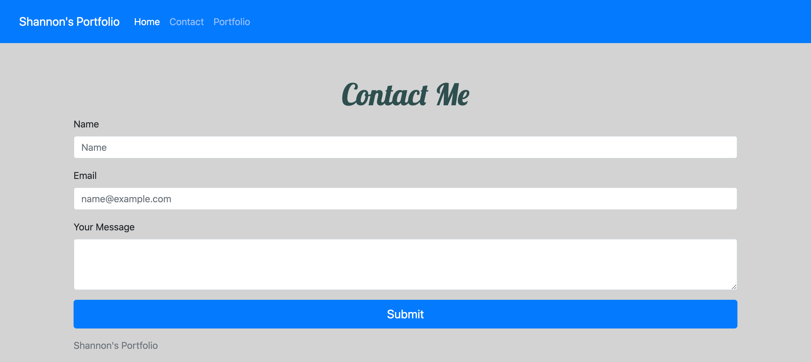

# Responsive-Portfolio
This project was to create a portfolio that would be responsive to different screen sizes. 
 
 
I started by creating three html files: one index, a contact, and a portfolio. Each page has the Bootstrap links required to use their built-in features. 
Each page has an identical navbar with relative links to each page. Thanks to Bootstrap, the navbar is responsive to smaller screen sizes. 
 
 
The first page is About Me. I used the Bootstrap grid system to create a two row, one column grid. The header "About Me" is in the first row, and my photo and biography is in the second row. I gave the photo a little padding so that the text would not appear too close to the photo. 
 
 
The next page is Contact Me. Using Bootstrap, I created a simple form to send me a message. The page also has a Bootstap grid of two rows and one column. The first row has the header "Contact Me" and the second row contains the form. The user would have to enter their name, email address, and a short message. Then I used a Bootstrap button as a "Submit" button. 
 
 
The last page is Portfolio. I used nine photos in a Bootstrap grid of four rows and three columns. The header "A few snapshots of my life!" appears in the first row but has no columns. Three photos appear in one row with equally spaced columns. When the screen is small, the photos stack on top of each other. The captions appear centered under each photo. 
Lastly, I added a sticky footer to each page.
  
  
I made an effort to do several commits through this project. 
 
 
I ran into some issues with the relative paths- forgetting to capitalize the 'A' in 'assets' was the source of a lot of it! 
 
 
Link to page: https://shannonquinn91.github.io/Responsive-Portfolio/ 
 
 
Link to repo: https://github.com/shannonquinn91/Responsive-Portfolio
 
 
Screenshots:

